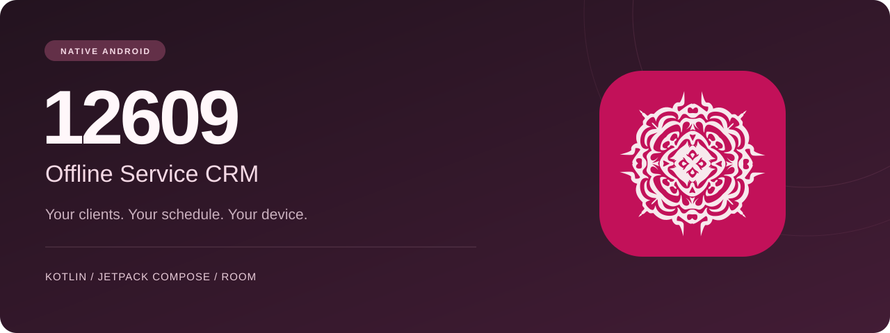
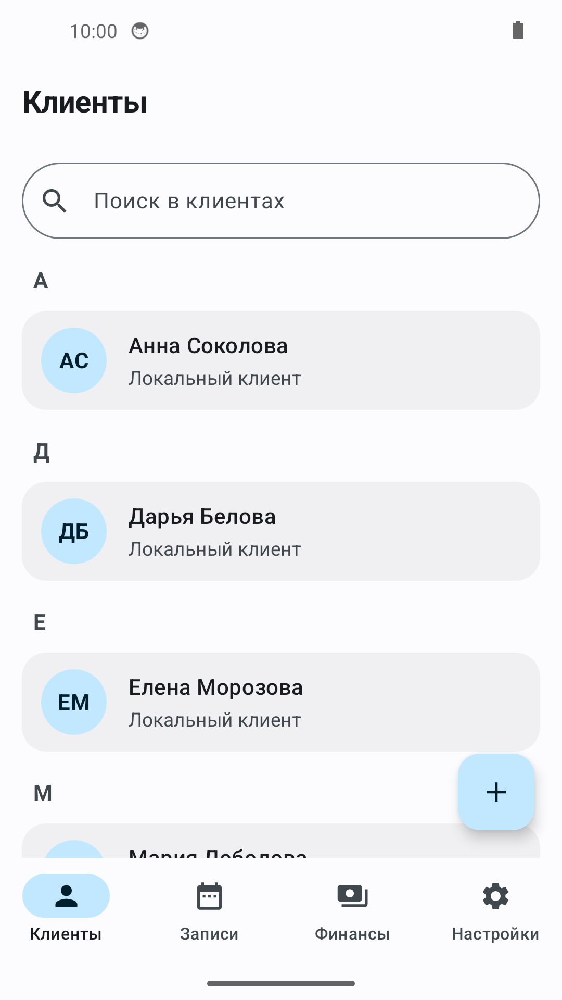
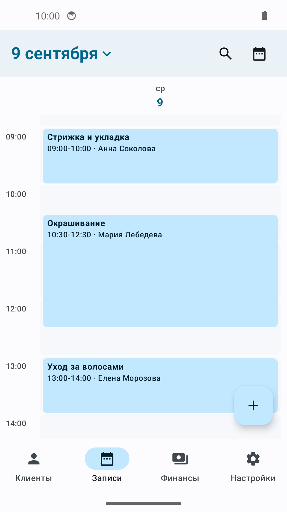
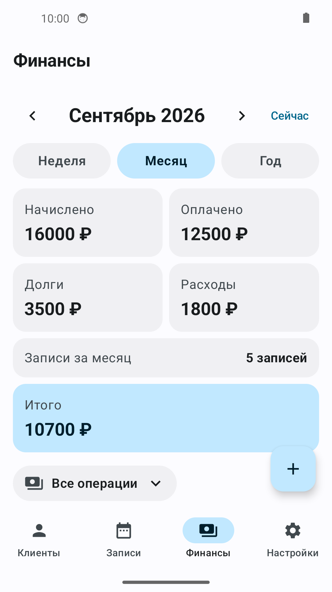

<p align="center">
  <a href="README.md">English</a> · <a href="README.ru.md">Русский</a> · <a href="README.de.md">Deutsch</a> · <a href="README.es.md">Español</a>
</p>

<p align="center">
  
</p>

<h1 align="center">12609 · Offline Service CRM</h1>
<p align="center"><strong>Clients, appointments and finances. Together on your Android device.</strong></p>

<p align="center">
  <a href="https://github.com/IgorNadein/12609/releases/latest"></a>
  <a href="https://github.com/IgorNadein/12609/actions/workflows/android-release.yml"></a>
  
  
</p>

<p align="center">
  <a href="https://github.com/IgorNadein/12609/releases/latest"><strong>Download APK</strong></a> ·
  <a href="https://github.com/IgorNadein/12609/releases">Releases</a> ·
  <a href="docs/DEVELOPMENT.md">Build & development</a> ·
  <a href="https://github.com/IgorNadein/12609/issues">Report an issue</a>
</p>

A native Android CRM for independent service professionals and small businesses that work by appointment. Manage everyday work locally, with optional Android contacts and calendar integration.

## A look inside

<table>
  <tr><th>Clients</th><th>Appointments</th><th>Finances</th></tr>
  <tr>
    <td width="33%"></td>
    <td width="33%"></td>
    <td width="33%"></td>
  </tr>
</table>

Actual screenshots of version 0.4.0 on an Android emulator with fictional demo data. The app interface is currently in Russian; README translations are available above.

## Made for the working day

| | |
| :--- | :--- |
| **Clients** | Keep client profiles, contact details and notes; optionally link them to Android contacts. |
| **Appointments** | Plan in day, 3-day, week and month views. Manage services, duration and days off. |
| **Services & finances** | Maintain prices and durations, record payments, track debts, income and expenses. |
| **Automation** | Set up SMS workflows with a task queue and confirmation options. |
| **Backup & updates** | Export and import JSON backups, configure automatic backups and check GitHub Releases for APK updates. |

### Local by default

Core CRM records live in a Room/SQLite database on the device. Everyday record keeping works offline. Contact and calendar integration uses Android system providers; connected accounts may sync through their own services. SMS requires device support and permission. Release checks and APK downloads use the internet.

## Try the app

1. Open the [latest release](https://github.com/IgorNadein/12609/releases/latest) and download the `.apk` under **Assets**.
2. Install it on Android 8.0 or newer. If prompted, allow installation from the app used to open the APK.
3. Add a client, create a service and book an appointment. Configure optional integrations and backups in Settings.

> This repository is a portfolio snapshot. Published APKs use a legacy signing key that was previously committed; treat that key as compromised. Use a new signing key for production distribution. See [release signing](docs/DEVELOPMENT.md#release-signing).

## Built with

**Kotlin** · **Jetpack Compose** · **Material 3** · **Room / SQLite** · **Coroutines / Flow** · **WorkManager** · **GitHub Actions**

## Explore the source

The application currently keeps most UI, database and integration logic in `MainActivity.kt`. Calendar indexing and related performance helpers live in `PerformanceState.kt`.

- [MainActivity.kt](offline-beauty-crm/app/src/main/java/com/offlinebeautycrm/MainActivity.kt)
- [PerformanceState.kt](offline-beauty-crm/app/src/main/java/com/offlinebeautycrm/PerformanceState.kt)
- [PerformanceStateTest.kt](offline-beauty-crm/app/src/test/java/com/offlinebeautycrm/PerformanceStateTest.kt)
- [Android Release APK](.github/workflows/android-release.yml)

## Build locally

Use **JDK 17**, **Gradle 8.14.3** and **Android SDK Platform 36**. There is no Gradle wrapper in the repository.

```bash
git clone https://github.com/IgorNadein/12609.git
cd 12609/offline-beauty-crm
gradle :app:assembleDebug
```

See the [development guide](docs/DEVELOPMENT.md) for SDK configuration, unit tests, project structure and signed releases.

## Feedback

Found a problem or have an idea? [Open an issue](https://github.com/IgorNadein/12609/issues). Include the app version, Android version and steps to reproduce; use fictional data in examples.
